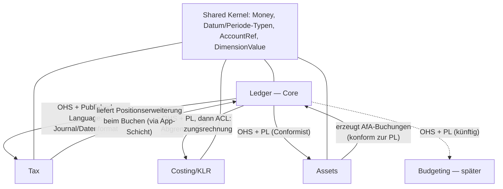

# Context Map

**Status: Phase-2-Stand 2026-06-07.** Löst die vorläufige Skizze in `archiv/subdomains-und-kontexte.md` ab, wo abweichend. Provisional, aber präzise — Änderungen über das Entscheidungslog.

## Die Kontexte

| Kontext | Sprache (Kernbegriffe) | Schicht | Status |
|---|---|---|---|
| **Ledger** (Buchführung) | Buchung, Konto, Periode, Soll/Haben, Festschreibung, offener Posten | Kern | **Core Domain** — hier modellieren wir am tiefsten |
| **Tax** (Steuern) | Steuerschlüssel, Soll/Ist-Versteuerung, Kennzahl, Vorsteuer | Kern (Services) + Regelmodule (Inhalte) | erste Generation |
| **Costing** (KLR) | Kosten, Kostenstelle/-träger, Umlage, BAB, Abgrenzung | Kern (Engine) + Regelmodule (Schemata) | erste Generation |
| **Assets** (Anlagen) | Anlagegut, Nutzungsdauer, AfA, Restbuchwert | Kern (Engine) + Regelmodule (AfA-Tabellen) | erste Generation |
| **Budgeting** (Haushalt, kommunal) | Ansatz, Obligo, Deckungsfähigkeit | später | nur Grenze reserviert |

**Kein eigener Kontext: Reporting** (Entscheidung 2026-06-07). Auswertungen haben keine eigene Sprache — sie sind Projektionen und gehören zu dem Kontext, dessen Sprache sie sprechen: Bilanz/GuV/SuSa/EÜR → Ledger, USt-VA-Kennzahlen → Tax, BAB → Costing. Die Gliederungs-Mappings (Konto → Bilanzposition, Konto → Anlage-EÜR-Zeile) sind Regelmodul-Daten.

## Beziehungen

### Ledger als Open-host Service mit Published Language

Ledger ist Upstream für alle anderen Kontexte, und es gibt viele Konsumenten → **Open-host Service**. Die **Published Language ist das spezifizierte Datenformat selbst** (Journal, Buchung, Position, Konto). Das fällt mit dem Projektziel „ein Datenformat für alle Implementierungen" zusammen — die Kompatibilitäts-Spec und die Published Language sind *dasselbe Artefakt*. Konsequenz: Format-Änderungen sind Context-Map-Änderungen und werden entsprechend ernst behandelt.

### Tax ↔ Ledger (beantwortet damit offene Frage „synchron oder nachgelagert")

Zwei getrennte Flüsse:

1. **Beim Buchen (synchron):** Tax stellt einen Domain Service `expand` bereit: Belegdaten + Steuerschlüssel rein → vollständige, ausbalancierte Buchungspositionen inkl. Steuerpositionen raus. Die **Anwendungsschicht des Packages** orchestriert: erst Tax fragen, dann bei Ledger buchen. Ledger bleibt gesetzesfrei — es sieht fertige Positionen mit opaken Steuer-Tags, nie einen Paragraphen. Kein Modell-Durchgriff von Tax in Ledger.
2. **Auswertung (nachgelagert):** Tax liest das Journal über die Published Language und projiziert USt-VA-Kennzahlen. Beziehung: **Conformist** — das Journalmodell passt für Tax unverändert.

### Costing ← Ledger: Anticorruption Layer

Der klarste Sprachbruch (Kosten ≠ Aufwand) bekommt die stärkste Isolierung. Der ACL ist fachlich vorgegeben: die **Abgrenzungsrechnung** übersetzt Aufwand → Kosten (neutraler Aufwand raus, kalkulatorische Kosten rein). Ein seltener Glücksfall: Die Domäne liefert das Übersetzungsartefakt selbst — der ACL ist keine technische Erfindung, sondern ein buchhalterisches Verfahren mit eigener Prüfbarkeit. Costing führt eigene Verrechnungsbuchungen (Umlagen, kalkulatorische Kosten) in einem **eigenen Rechnungskreis**, nie im Fibu-Journal.

### Assets ↔ Ledger: Conformist in beide Richtungen des Datenflusses

Assets führt das Anlageverzeichnis (eigenes Aggregat, eigene Sprache: Nutzungsdauer, Restbuchwert) und *erzeugt* AfA-Buchungen im Format der Published Language → normale Buchungen durchs normale Journal (kein Sonderweg, wie in `13-doppik-hgb.md` gefordert). Die Verknüpfung Anlagekonto ↔ Anlagegut ist Assets-seitige Konfiguration.

### Budgeting (später): Grenze jetzt reserviert

Bekannte Spannung: Verfügbarkeitsprüfung muss *vor* der Buchung passieren (synchron), Budgetfortschreibung danach (asynchron, via `EntryPosted`-Events). Lösung wird ein **Pre-Posting-Hook in der Anwendungsschicht** sein — dieselbe Stelle, an der Tax expandiert. Das Modell legt sich heute nur fest: Ledger selbst wird *keine* Budgetlogik enthalten.

### Shared Kernel: klein und stabil

Money, Datums-/Periodentypen, AccountRef, DimensionValue — gemeinsam genutzte Werttypen aller Kontexte. Bewusst minimal gehalten (Shared Kernel braucht Disziplin: Änderungen betreffen alle). Was nicht jeder Kontext braucht, gehört nicht hinein.

## Distillation

**Core Domain:** Ledger + das Datenformat (= Published Language). Hier liegt die Differenzierung: GoBD-feste, implementierungsübergreifend identische Buchführungsmechanik. Hierhin geht der größte Modellierungs- und Testaufwand.
**Supporting:** Tax, Costing, Assets — regelintensiv, aber bekanntes Terrain.
**Generic:** Persistenz-Adapter, ID-Erzeugung, Serialisierung — Standardtechnik, keine Modelltiefe.
